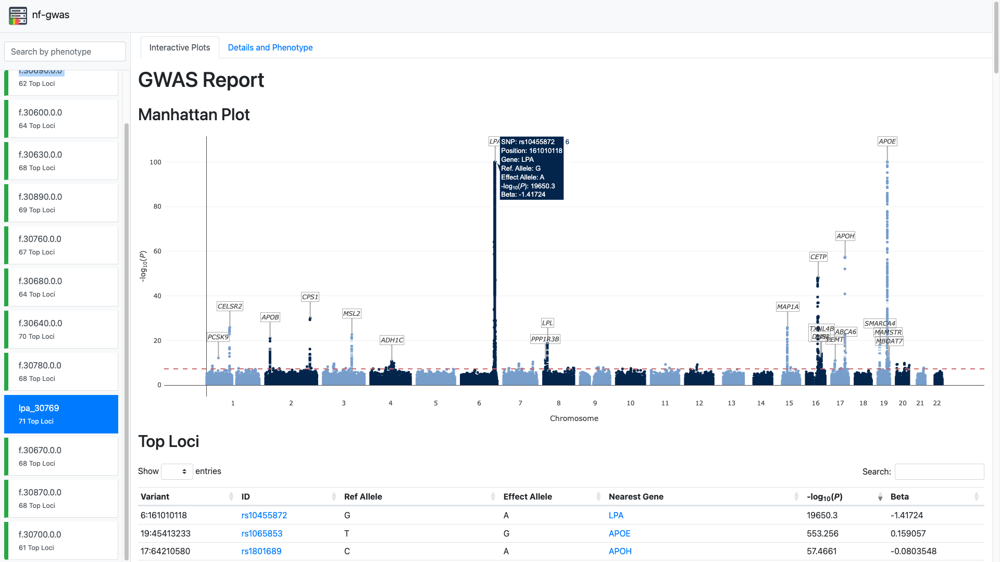

# nf-gwas

**nf-gwas** is a Nextflow pipeline to run genome-wide association studies (GWAS) analysis. The pipeline automatically performs numerous pre- and post-processing steps, integrates regression modeling from the REGENIE package and currently supports single-variant, gene-based and interaction testing. All modules are structured in sub-workflows which allows to extend the pipeline to other methods and tools in future. nf-gwas includes an extensive reporting functionality that allows to inspect thousands of phenotypes and navigate interactive Manhattan plots directly in the web browser. 



## Overall pipeline


## Quick Start

1. Install [Nextflow](https://www.nextflow.io/docs/latest/getstarted.html#installation) (>=22.10.4)


2. Run the pipeline on your data

```
# install using :
git clone https://github.com/ankurgenomics/gwas_nf
cd gwas_nf
cd Nextflow_Scripts
# change the parameters and location of files as per your local directories in config
nextflow run main.nf -c <nextflow.config>  -profile docker
```

## Development

```
git clone https://github.com/ankurgenomics/gwas_nf
cd gwas_nf
nextflow run main.nf -profile test,development
```

## nf-test

nf-gwas makes use of [nf-test](https://github.com/askimed/nf-test), a unit-style test framework for Nextflow.

```
cd nf-gwas
curl -fsSL https://code.askimed.com/install/nf-test | bash
./nf-test test
```

## Demo Outputs
A detailed project summary, phenotype stats, Manhattan Plot, Significant loci, QQ Plot, Validation and Logs are in the 
[index_reports](https://github.com/ankurgenomics/gwas_nf/tree/274ef38c06255b25cd77587db5cb965505c6ba88/OUTPUT/TEMUS_ETH_2/index_reports) of each sample and phentype 

Top hits for each can be find at 
 [HITS] (https://github.com/ankurgenomics/gwas_nf/tree/28aa91346b443393829803285c2a80427a39f361/OUTPUT/TEMUS_ETH_2/results/tophits)


## Contact

- [Ankur Sharma](mailto:ankur012@e.ntu.edu.sg)


